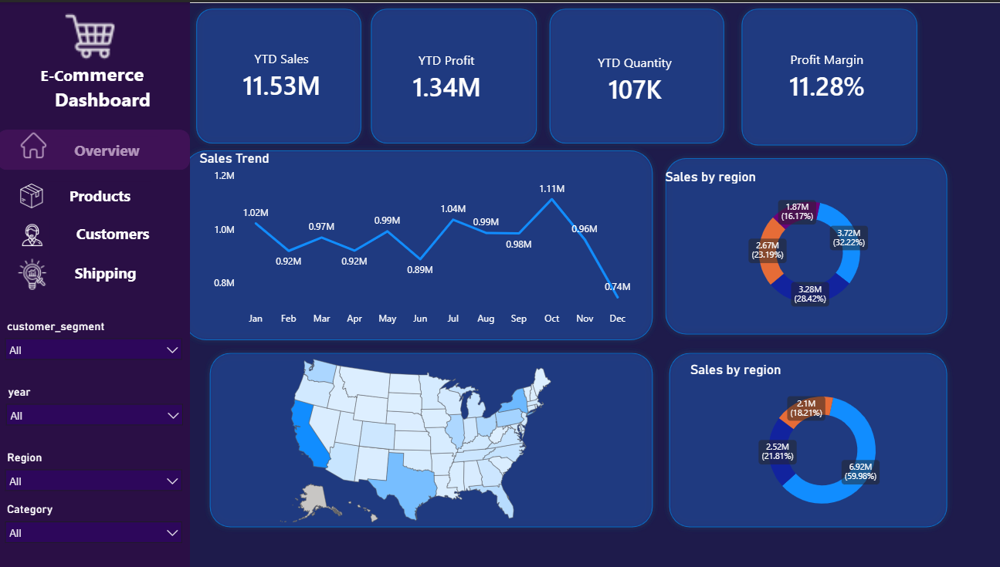
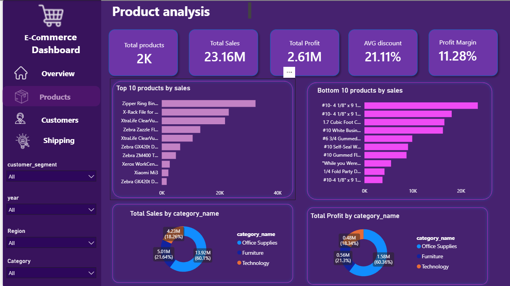
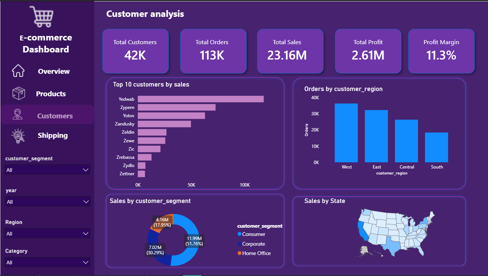
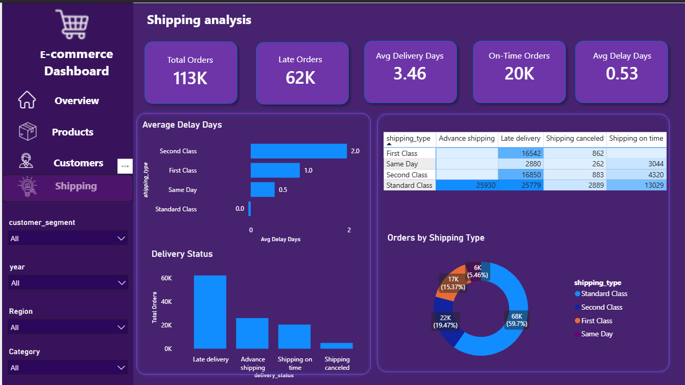

# 🛒 E-Commerce Sales Dashboard

## 📊 Project Overview

An interactive E-Commerce Sales Dashboard built using Microsoft Power BI to analyze sales, profit, customers, products, and shipping performance.

The dashboard transforms raw e-commerce data into meaningful business insights using interactive visualizations and filters.

## 🎯 Business Objectives

- Analyze overall sales and profit performance
- Identify top and bottom performing products
- Understand customer purchasing patterns
- Compare sales across regions
- Analyze product categories
- Monitor shipping and delivery performance
- Identify trends to support business decisions

## 🛠️ Tools & Technologies

- Microsoft Power BI
- Power Query
- DAX
- Data Cleaning
- Data Visualization

## 📑 Dashboard Pages

### 1. Overview
- YTD Sales
- YTD Profit
- YTD Quantity
- Profit Margin
- Sales Trend
- Sales by Region
- Geographic Sales Distribution

### 2. Product Analysis
- Total Products
- Total Sales
- Total Profit
- Average Discount
- Profit Margin
- Top 10 Products by Sales
- Bottom 10 Products by Sales
- Sales by Category
- Profit by Category

### 3. Customer Analysis
- Total Customers
- Total Orders
- Total Sales
- Total Profit
- Profit Margin
- Top Customers by Sales
- Orders by Customer Region
- Sales by Customer Segment
- Sales by State

### 4. Shipping Analysis
- Total Orders
- Late Orders
- Average Delivery Days
- On-Time Orders
- Average Delay Days
- Average Delay by Shipping Type
- Delivery Status
- Orders by Shipping Type
# 🛒 E-Commerce Sales Dashboard

## 📊 Project Overview

An interactive E-Commerce Sales Dashboard built using Microsoft Power BI to analyze sales, profit, customers, products, and shipping performance.

The dashboard transforms raw e-commerce data into meaningful business insights using interactive visualizations and filters.

## 🎯 Business Objectives

- Analyze overall sales and profit performance
- Identify top and bottom performing products
- Understand customer purchasing patterns
- Compare sales across regions
- Analyze product categories
- Monitor shipping and delivery performance
- Identify trends to support business decisions

## 🛠️ Tools & Technologies

- Microsoft Power BI
- Power Query
- DAX
- Data Cleaning
- Data Visualization

## 📑 Dashboard Pages
## 📸 Dashboard Preview

### 📊 Overview

### 🛍️ Product Analysis

### 👥 Customer Analysis

### 🚚 Shipping Analysis

### 1. Overview
- YTD Sales
- YTD Profit
- YTD Quantity
- Profit Margin
- Sales Trend
- Sales by Region
- Geographic Sales Distribution

### 2. Product Analysis
- Total Products
- Total Sales
- Total Profit
- Average Discount
- Profit Margin
- Top 10 Products by Sales
- Bottom 10 Products by Sales
- Sales by Category
- Profit by Category

### 3. Customer Analysis
- Total Customers
- Total Orders
- Total Sales
- Total Profit
- Profit Margin
- Top Customers by Sales
- Orders by Customer Region
- Sales by Customer Segment
- Sales by State

### 4. Shipping Analysis
- Total Orders
- Late Orders
- Average Delivery Days
- On-Time Orders
- Average Delay Days
- Average Delay by Shipping Type
- Delivery Status
- Orders by Shipping Type

## 🔍 Dashboard Features

- Interactive page navigation
- Year filter
- Customer segment filter
- Region filter
- Category filter
- Synchronized slicers across pages
- KPI cards
- Interactive charts
- Geographic visualization
- Product performance analysis
- Customer analysis
- Shipping analysis

## 💡 Key Insights

The dashboard helps identify:

- Regional differences in sales performance
- High and low performing products
- Customer segments contributing to sales
- Product category performance
- Shipping and delivery performance
- Areas where business performance can be improved

## 👩‍💻 Author

**Varsha Jaini**

Computer Science & Engineering Student | Aspiring Data Analyst

**Skills:** Power BI | SQL | Excel | Python | Data Analytics

## 🔍 Dashboard Features

- Interactive page navigation
- Year filter
- Customer segment filter
- Region filter
- Category filter
- Synchronized slicers across pages
- KPI cards
- Interactive charts
- Geographic visualization
- Product performance analysis
- Customer analysis
- Shipping analysis

## 💡 Key Insights

The dashboard helps identify:

- Regional differences in sales performance
- High and low performing products
- Customer segments contributing to sales
- Product category performance
- Shipping and delivery performance
- Areas where business performance can be improved

## 👩‍💻 Author

**Varsha Jaini**

Computer Science & Engineering Student | Aspiring Data Analyst

**Skills:** Power BI | SQL | Excel | Python | Data Analytics
